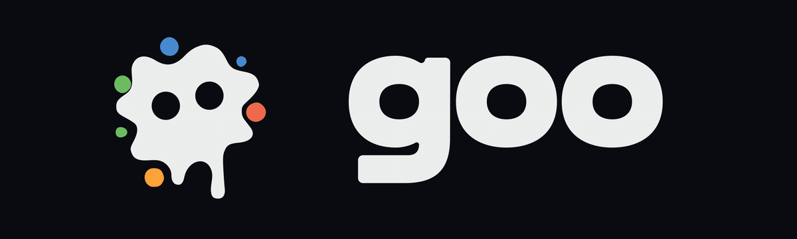

<p align="center">
  
</p>

<p align="center">A declarative desktop UI framework for G#.</p>

<p align="center">
  <a href="https://github.com/obselate/goo/actions/workflows/ci.yml"></a>
  <a href="LICENSE"></a>
</p>

Goo is a retained UI framework with a small, direct core. Applications describe
fresh UI trees in ordinary G#. Goo retains runtime state, rebuilds dirty `Cell`
boundaries, lays out with Yoga, and renders with Skia.

Applications keep full control over their visual identity.

## Install

Goo 0.1.0 targets .NET 10:

```xml
<PackageReference Include="Goo" Version="0.1.0" />
```

The first release supports `linux-x64` on glibc 2.35 or newer. It requires a
native Wayland session and the system Fontconfig runtime (`libfontconfig1` on
Ubuntu). X11 and XWayland backends are outside the 0.1 release.

## Build a component

```csharp
package App

import Goo

class Counter : Cell {
  private var count int32

  public override func Build() Blob ->
    Container {
      Width: 320,
      Padding: 24,
      Gap: 12,
      BorderRadius: 16,
      BackgroundColor: "#181f2b",
      Children: {
        Text {
          Content: "Count: $count",
          FontSize: 24,
          Color: "#f4f7ff",
        },
        Button {
          Padding: 10,
          BorderRadius: 10,
          BackgroundColor: "#4a7dff",
          OnClick: () -> count++,
          Children: { 
            Text { 
              Content: "Add one", Color: "#ffffff" 
            } 
          },
        },
      },
    }
}

func Main() {
  Window.ConfigureApplication("Counter", "1.0.0", "com.example.counter")
  Window{ Title: "Counter", Root: Counter{} }.Run()
}
```

`Cell` owns state and defines the rebuild boundary. Its `Build` method returns a
new tree of lightweight `Blob` descriptions. Goo compares that tree with the
retained runtime nodes, then schedules the layout and paint work caused by the
change.

## What Goo optimizes for

- **Primitives** Layout, text, images, vector paths, input, motion, editing,
  accessibility, and windows form a public surface for application-level
  composition.
- **G# Best practices** Components use classes, functions, loops, typed values, and
  ordinary control flow.
- **Frame discipline** Retained nodes, scoped invalidation, reusable caches,
  and allocation budgets keep CPU time and memory traffic visible.

Themes, design systems, and widget libraries live in application code or
reusable packages. The core provides base primitives for creating applications via composition and widgets.

## Documentation

- [API reference](https://github.com/obselate/goo/tree/main/docs/api)
- [Cell and component state](https://github.com/obselate/goo/blob/main/docs/api/cell.md)
- [Layout](https://github.com/obselate/goo/blob/main/docs/api/layout.md)
- [Style](https://github.com/obselate/goo/blob/main/docs/api/style.md)
- [Text editor](https://github.com/obselate/goo/blob/main/docs/api/text-editor.md)
- [Accessibility](https://github.com/obselate/goo/blob/main/docs/api/accessibility.md)
- [Release notes](CHANGELOG.md)

The package includes `Goo.xml` for editor documentation.

## Credits

Goo uses Skia through SkiaSharp for drawing and text. 
Layout uses Meta Yoga through the vendored Yoga.Net port. 

See the [third-party notices](THIRD-PARTY-NOTICES.md)
for versions and license terms.

## License

Goo is available under the [MIT License](LICENSE).
