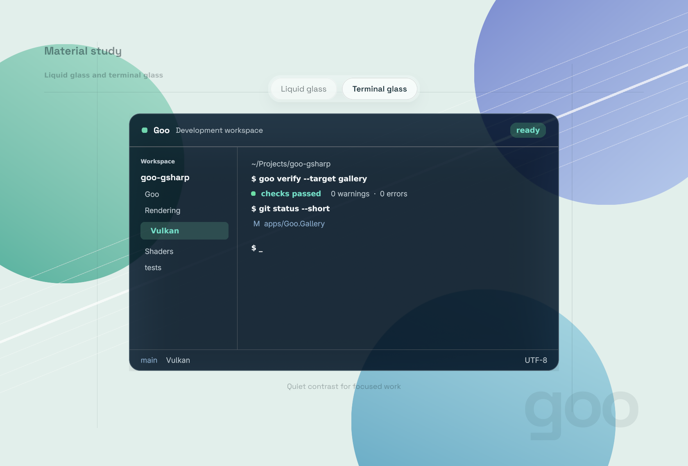
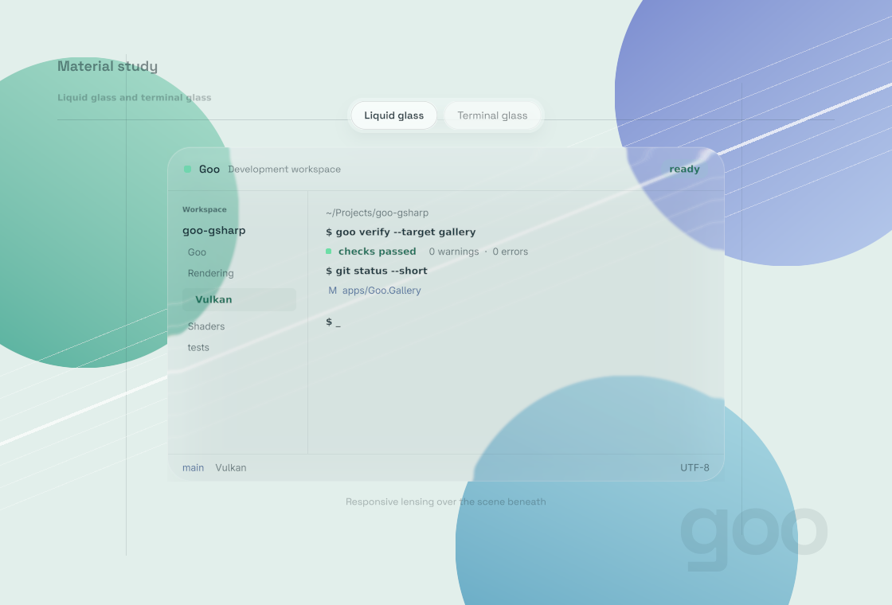

# Glass materials

Run the Gallery with `--glass-lab`. The two mode buttons switch retained effects. Pointer motion updates shader parameters without rebuilding the UI or running an idle animation.

## Terminal glass

Dark navy transmission, restrained blur, an 18-pixel rounded edge, and crisp foreground text. Background shapes remain visible through the material. The reference is the user-provided Superlogical image, interpreted as a material direction rather than a window clone.

## Liquid glass

Clear glass with edge refraction, a thickness profile, subtle chromatic dispersion, and pointer-responsive highlights. Foreground text remains undisplaced. The optical direction follows [Apple's Liquid Glass material presentation](https://developer.apple.com/videos/play/wwdc2025/219/).

## Authoring

Both Slang effects sample previously drawn content within the Goo window. The lab does not capture the operating system desktop. Use a 24-logical-pixel backdrop outset with these effects. Parameter slot 1 controls the pointer, slot 2 controls blur/tint/grain/radius, slot 3 controls sRGB tint/opacity, and slot 4 controls rim intensity, pointer lighting, and the explicit-configuration marker in W.

Sources are `apps/Goo.Gallery/GlassMaterialWindow.gs` and `apps/Goo.Gallery/Shaders/{terminal_glass,liquid_glass}.frag.slang`. The existing `--glass` window uses the same terminal shader with adjustable material controls. The terminal screenshot is a native 150% capture and liquid is a native 100% capture. The full Release build and strict project lint pass. ShaderEffectSmoke covers device recovery and a before/fix regression for scaled text readback. See [recovery verification](perf/shader-effect-recovery-2026-09-05.md).
